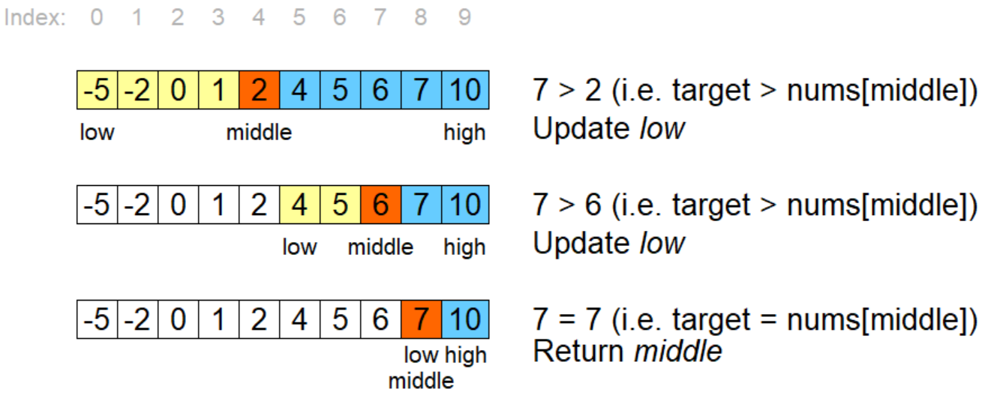

# Binary Search

It is a searching alsgorithm which only works on **sorted array or list** where it repeatedly divides the search space in half until the target is found.

    #iterative approach(easy way)
    def binarysearch(m,n):
        low = 0
        high = len(m)
        while low <= high:
            mid = (low+mid)//2
            if n > m[mid]:
                low = mid+1
            elif n < m[mid]:
                high = mid -1
            else:
                return mid
        return False

### line by line explanation --

    def binarysearch(m,n):

defined a function named "binarysearch" that searches for value n in sorted list m

    low = 0

start index of each interval (left boundary)

    high = len(m) - 1

end index of each interval (right boundary)

    while low <= high:

Reapeat as long as thesearch interval is not empty

    mid = (low + high)//2

middle index of the list or array 

    if n > m[mid]:

if the search element is greater than the middle element than the search element will lie right side of the list

    low = mid + 1 

to set the left boundary just next of the middle element index to search from their to the rightmost boundary

    elif n < m[mid]:

if the search element is less than the middle element then it will be found in the left side of the middle element.

    high = mid - 1

to set the right boundary just before the middle element to search from their to the to the leftmost boundary

    else:
        return mid

if not found in two halves of the middle element then it must be equal to the middle element

    return False

if loop exits the search element is not in the array or list so return false 

## Recursive binary search --

    def binarysearch(m,n,low,high)
        if high - low < 0:
            return False
        mid = (low + high)//2

        if n == m[mid]:
            return mid
        if n > m[mid]:
            return(binarysearch(m,n,mid+1,high))
        else:
            return(binarysearch(m,n,low,mid-1))

### line by line explanation

    def binarysearch(m,n,low,high)

function declared -- search n in m between indices low and high

    if high - low < 0:

Base case: interval empty → not found.

    mid = (low + high)//2

Compute middle index.

    if n == m[mid]:

found the search element in the middle index. so return the middle index

    if n > m[mid]:
        return (binarysearch(m,n,mid + 1,high))

If middle is less, search right half. Recurse with new low = mid + 1.

    else:
        return (binarysearch(m,n,low,mid - 1))

If middle is greater, search left half. Recurse with new high = mid - 1.

## Complexity --
- Best case -- **O(1)**
- worst case -- **O(log n)**
- Average case -- **O(log n)**
  

