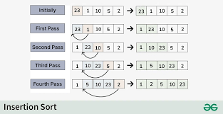

# Insertion Sort

Insertion sort is a simple sorting algorithm that builds the final sorted list one element at a time

Start from the second element

Compare the element with the previous element

Shift the larger element to the right

Insert the current element into its correct postion

repeat the process

    def insertionsort(l):
        n = len(l)
        if n < 1:
            return(l)
        for i in range(n):
            j = i
            while j > 0 and l[j] < l[j-1]:
                (l[j],l[j-1]) = (l[j-1],l[j])
                j = j-1
        return (l) 

    def insertionsort(l):

defiend a function named insertionsort with a list 'l'

    n = len(l)

we stored the length of the list 'l' in a variable n

    if n < 1:
        return (l)

if the list is empty then we will return the list as it is

    for i in range(n):
        j = i

the loops moves through the left to right 
- when i = 0: the first element is already sorted
- when i = 1: insert l[1] in to the sorted part of [l[0]]

now a pointer j is declared that staets at the index i

j will move backward to insert the current value into its proper position.

    while(j > 0 and L[j] < L[j-1]):

the loop will continues until 

we have not reached the left

the current element is smaller than the previous one

this means the current value is wrongly placed and need to move on the left side

    (l[j],l[j-1]) = (l[j-1],l[j])

swap the smaller one to the left side 

    j = j - 1

move the pointer leftward to continue checking for the previous elements

    return (l)

return the sorted element

## Complexity --
- Best Case -- O(n) if the list is already sorted
- Average case -- O(n^2^)
- Worst case -- O(n^2^)
- Stable -- Yes
- Sort in place -- Yes

