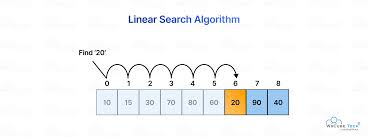

# Linear Search

We are trying to search a element in a list or array

    def linear_search(m,n):
        for i in range(len(m)):
            if n == m[i]:
             return i
        return(False)

so this is the baseic searching method which we normally used to search for a element in a small array

## Line by line Explanation 

    def linear_search(m,n):

In the first line a function named "linear_search" is defined where two variables are taken one in 'm' which is the list and 'n' which is the element which we will search for.

    for i in range(len(m)):

In the second line we are running a for loop to loop over to the every index of the list 'm' with the help of 'len(m)' and we are storing the index in 'i'

    if n == m[i]:

In the third line we are checking if the current element of the list in that index is equals to the element we are searching for

    return i

If it matches then we will return the index of the list 'm' which we stored in i

    return(False)

If loop completes and we can't find the value that matches then it will return 'False' that means the array doesn't contain the element

### Complexity --

- Best case -- O(1) (if we find the element in the first index)
- Worst case -- O(n) (we need to find loop through 'n' indexes)
- Average case -- O(n)

