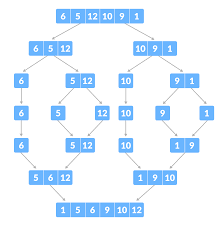

# Merge Sort

In this sorting technique we will use divide and conquer technique where we will break the problem into very small pieces in order to find the optimal solution.

Here we will also use recursion and we will recursively divide the list into half and sort them individually and then we will merge them.

    def merge(a,b):
        (x,y) = (len(a),len(b))
        (c,i,j) = ([],0,0)

        while i < x and j < y:
            if a[i] <= b[j]:
                c.append(a[i])
                i += 1
            else:
                c.append(b[j])
                    j += 1

        while i < x:
            c.append(a[i])
            i += 1
        
        while j < x:
            c.append(b[j])
            j += 1

        return c

    def mergesort(l):
        n = len(l)
        if n <= 1:
            return l
        left_half = mergesort(l[: n// 2])
        right_half = mergesort(l[n//2 :])
        sorted_merged_list = merge(left_half, right_half)
        return sorted_merged_list

## Line by line explanation

    def merge(a,b):

define a function named as 'merge' that takes two values a and b (precondition -- a and b are already sorted)

    (x,y) = (len(a), len(b))

set x to the length of the 'a' and y to the length of the 'b' 

    (c, i, j) = ([], 0, 0)

- c -- the output list that will hold the merged list
- i -- current index into list a
- j -- current index into list b

both pointers start at 0

    while i < x and j < y:

run the loop until both the list have elements and we will compare them repeatedly

    if a[i] <= b[j]:
        c.append(a[i])
        i += 1

compare the current elements at two pointers. if a[i] is less than or equal to b[j] then append a[i] to list 'c' and increment the index of the i by 1 as we already added it to the list

    else:
        c.append(b[j])
        j += 1

if the upper condition is false then b will get appended to the list 'c' and increment the index 'j' by 1 as we already added it to the list

    while i < x:
        c.append(a[i])
        i += 1

If a still has elements left (i.e., b was exhausted), enter this loop.Copy the remaining a elements into c, advancing i each time. No comparisons needed because a is already sorted and all its remaining items are greater than everything already in c.

    while j < y:
        c.append(b[j])
        j += 1

If b still has elements left, copy them into c, and the same will repeat for the 'b' also

    return c

Return the merged sorted list c. 

    def mergesort(l):

define the recursive merge sort function on list l

    n = len(l)
    if n <= 1:
        return l

we stored the length of the l in n and then we are checking whether it is lesser than 1 or not and if it is then it will return the list as it is

    left_half = mergesort(l[: n // 2])

l[: n // 2] slices the list from index 0 up to (but not including) n//2. Recursively sort that left half and store the sorted result in left_half.

    right_half = mergesort(l[n // 2 :])

l[n // 2 :] slices from n//2 to the end (this is the right half). Recursively sort that right half and store the sorted result in right_half.

    sorted_merged_list = merge(left_half, right_half)

merge these two halves using merge function.

    return sorted_merged_list

Return the sorted list up to the caller

## Complexity --
- Best Case - O(n log n)

- Average Case - O(n log n)

- Worst Case - O(n log n)

