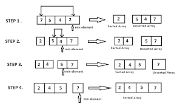

# Selection Sort
Selection sort is a simple comparison-based sorting algorithm.

1. Set the first element as the minimum value in the unsorted list
2. Iterate through the unsorted part of list and compares each of the element to the minimum value
3. if a smaller element is found then it becomes the minimum value and it is swaped with the first element of the unsorted part of the list

Repeatedly find the smallest element in the unsorted part.

Swap that smallest element with the first element of the unsorted part.

Increase the sorted portion by one and repeat until the list becomes sorted.

    
    def selection_sort(m):
        n = len(m)
        if n < 1:
            return(m)
        for i in range (n):
            minpos = i
            for j in range (i+1,n):
                if m[j] < m[minpos]:
                    minpos = j
            (m[i],m[minpos]) = (m[minpos],m[i])
        return(m)
            

### line by line explanation --

    def selection_sort(m):

defined a function named "selection_sort" that takes a lint m

    n = len(m)

stored the length of the list m in a variable named 'n'

    if n < 1:
        return(m)

if the list is empty then it will return the empty list without sorting

    for i in range(n):

i represents the index where the next smallest element should be placed

    minpos = i

assume the element in the current position is the minimum 

    for j in range of (i+1,n):

inspect every element after i index and j scans the unsorted list after i

    if m[j] < m[minpos]:

compare the current element with the current minimum and if m[j] is smaller than the current minimum then

    minpos = j

the current element will become the current minimum

    [m[i],m[minpos]] = (m[minpos],m[i])

swap the smallest no. with the element at index i

    return(m)

at the end return the sorted array

## Complexity --

- Best case -- **O(n^2^)** (if the list is already sorted)
- Average case -- **O(n^2^)** 
- Worst case -- **O(n^2^)** 
- Stable -- No
- Sort in place --yes

